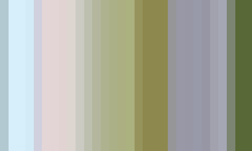

# Ubisoft - Barcode test

Hi there! Thanks for the opportunity to work on this test. I had a lot of fun working 
on it and I hope you'll like it. It was fun to revisit OpenCV and to learn about the
SKIA library.

My generated barcode looks like this:

 

## Answers to the questions

**How long did it take you to complete this assignment?**
- It took me 1 h 12 min to configure the repository, complete this assignment and to write this README.

**What would you do, if you had more time?**
- If I had more time, I would have added command line arguments to the program to be able to change the image
  size, the input video location, the delta time, etc.

**What is your feedback on the assignment?**
- I think this assignment is a good way to evaluate knowledge in the use of OpenCV library, as well as some
    knowledge in image processing. I think it would be interesting to demand a barcode not only of a video file,
    but also to a video stream; from a webcam for example, using `cv2.VideoCapture(0)`.